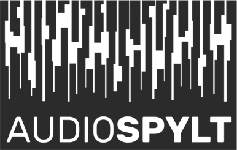

# AudioSpylt

AudioSpylt is a Python-based toolbox tailored for sound analysis, re/synthesis, and diverse visual & symbolic sound representations. Predominantly designed for instructional use, this toolbox operates within the Jupyter Notebooks environment. Initially developed for composition students I mentored last year, it emphasizes varied resynthesis patterns.

## Toolbox Overview

### 1. **Instructional Notebooks**

These notebooks are designed to provide comprehensive explanations and demonstrations on core audio concepts:

- **wave_sampling_window**: 
  - Covers sampling rate, Nyquist Frequency, window functions
  - Discusses implications of sampled material length on frequency resolution

- **wave_vs_dft_3d**: 
  - Displays 2D and 3D representations of DFT spectra
  - Emphasizes sine/cosine component visuals

### 2. **Analysis Notebooks**

- **audio_load_dft**:
  - Incorporates basic audio editing functions such as trim and fade
  - Offers customizable peak detection methods
  - Features thresholding functions and splits analysed data into multiple DFTs

### 3. **Visualizations and Symbolic Rendering**

- **visual_tsv**:
  - Plotting scripts for TSV/data frames

- **symbolic_mei**:
  - Symbolic visualizations tailored for data frames

### 4. **TSV Manipulations and Resynthesis**

- **df_pitch_stretch**:
  - Implement pitch/stretch alterations on TSVs with time domain data

- **2df_copypaste, 2df_merge**:
  - Execute freeze effects and various kinds of spectral interpolation

- **resynth**:
  - Resynthesize based on TSVs containing time domain data

## Getting Started

To get started, clone the repository, and set up your Jupyter Notebook environment to run the notebooks.

## Dependencies

The following libraries are required to run AudioSpylt:

- requests
- numpy
- plotly
- librosa
- pandas
- scipy
- soundfile
- IPython
- verovio
- tqdm
- matplotlib

### Installation

To install the dependencies, navigate to the root directory of the project and run:

```
pip install -r requirements.txt
```

## Contributions

Feel free to contribute to the project by creating pull requests or by opening issues.

## License

This project is under the MIT License.
